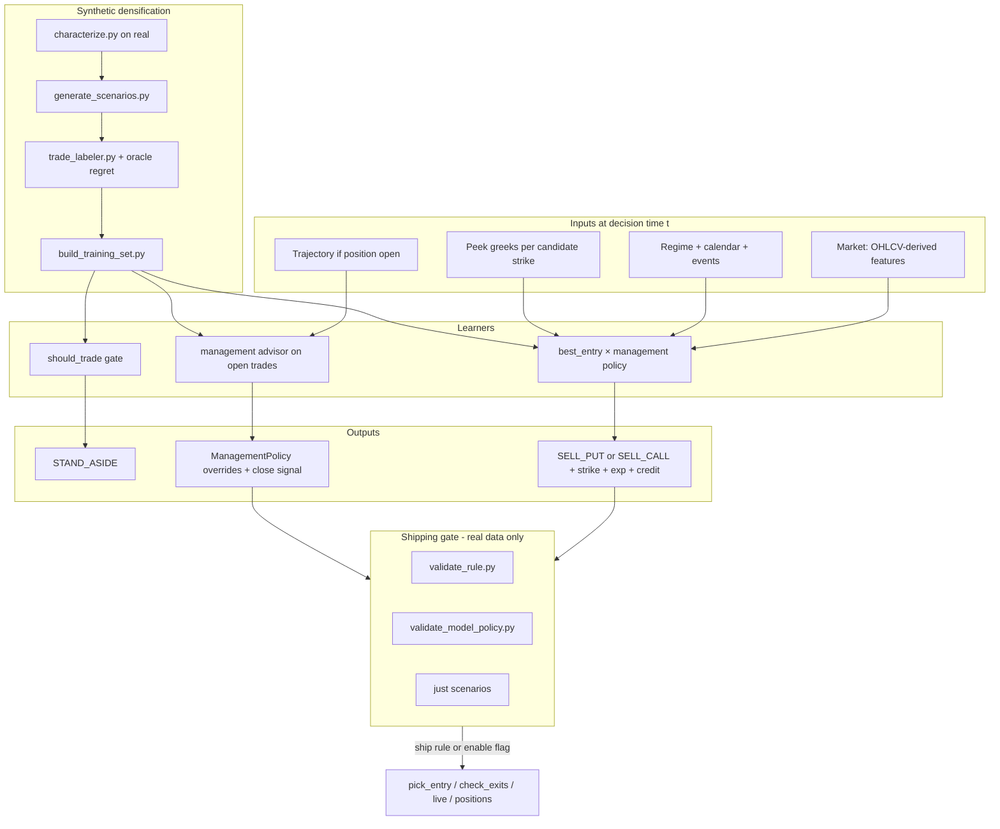

# Closed-Loop Strategy Finder — Design & Implementation Plan

**Date:** 2026-06-04  
**Status:** Active plan (supersedes scattered notes; complements `OPTIONS_MODEL_DESIGN.md`, `NORTH_STAR.md`, `GOAL.md`)  
**Goal:** Finish the end-to-end loop that finds optimal short-premium entries (put/call, strike, expiry) and per-trade exit policies, trained on dense synthetic + real labels, validated only on real history.

---

## 1. Vision (what “done” means)

At every decision bar (daily close today; 4h in a later phase), the system answers:

1. **Should I trade?** (stand aside vs enter)
2. **What to sell?** side, DTE, delta/strike, minimum credit, estimated premium
3. **How to manage?** profit target %, daily-capture pace, max loss, delta breach, roll policy
4. **For open trades:** hold vs close (and optional roll) using the same signals + path-so-far

Anything that ships must pass the **unchanged real-data firewall**: 5y backtest + 12-regime `just scenarios` + walk-forward OOS + cost function (`P/L − dd_weight × max_DD`, tail-first).

Synthetic simulation is for **training density and tail stress only**, never for shipping decisions alone.

---

## 2. System overview



**Two promotion paths (both valid):**

- **Distill to rules** — model/SHAP → small `ADAPTIVE_RULES` functions → `validate_rule.py` (proven path; v1.13 fleet).
- **Hybrid model** — `enable_model_entry` / `enable_model_management` behind flags → `validate_model_policy.py` (north-star path; not shippable yet).

---

## 3. Input feature catalog

All features are computed from data **≤ bar t** (no future leakage). Grouped by role.

### 3.1 Market & technical (from `data.py` — available on every bar)

| Feature | Description |
|---------|-------------|
| `ret_1d`, `ret_5d`, `ret_14d`, `ret_30d` | Trend / momentum horizons |
| `ema_9`, `ema_21`, `ema_55`, `ema_200` | Trend structure |
| `ema_stack` | −1..+1 stack score (bull/bear alignment) |
| `rsi_14` | Overbought/oversold |
| `macd`, `macd_signal`, `macd_hist` | Momentum |
| `atr_14` | Range / volatility scale |
| `bb_pctb` | Bollinger %B |
| `vol_20d_avg`, `volume_surge` | Participation |
| `hv_20`, `hv_30`, `hv_60` | Realized vol |
| `iv_proxy` | HV30 stand-in for IV (override with chain IV live) |
| `iv_rank`, `iv_rank_3y` | IV percentile (1y / 3y) |
| `intraday_return` | (close−open)/open % |
| `vix`, `vix_rank` | Macro vol context (when available) |

### 3.2 Regime & structure (from `_classify_regime`)

| Feature | Description |
|---------|-------------|
| `regime` | `bullish` / `bearish` / `neutral` |
| `reversal` | Intraday reversal flag |
| `high_iv` | IV rank elevated + weak trend guard |

### 3.3 Calendar & events

| Feature | Description |
|---------|-------------|
| `day_of_week` | 0=Mon … 4=Fri |
| `days_to_monthly_opex` | Days to 3rd Friday |
| `days_to_earnings`, `days_since_earnings` | TSLA earnings calendar (TSLL uses same) |

### 3.4 Candidate-specific “peek” (from `pricing.py` + `feature_utils.compute_peek_greeks`)

Computed **per candidate** `(side, dte, target_delta)` at spot S and `iv_proxy`:

| Feature | Description |
|---------|-------------|
| `peek_strike` | Rounded strike from delta target |
| `peek_credit` | BSM premium (short option credit) |
| `peek_theta_yield` | \|θ\|/day ÷ credit — theta efficiency |
| `peek_gamma_dollar` | Gamma dollar risk proxy |
| Full BSM greeks (available in `pricing.greeks`, not all in v1 model vector) | Δ, Γ, Θ, ν, ρ at peek strike |

**Note:** Training models today use the 4 peek scalars above; extending to full Δ/Γ/Θ/ν per candidate is a planned enrichment.

### 3.5 Entry action encoding (candidate grid)

| Field | Role |
|-------|------|
| `side` | `put` / `call` |
| `dte` | Calendar days to expiration |
| `target_delta` | Drives strike |
| `min_credit_pct` | Floor: credit/strike |

Default candidate grid (`trade_labeler.DEFAULT_ENTRY_ACTIONS`): 5 combos × 8+ management policies per state.

### 3.6 Management policy encoding (exit template)

Each policy is a named vector (one-hot `mgmt_*` in models):

| Knob | Meaning |
|------|---------|
| `profit_target` | Close when P/L ≥ this × credit (e.g. 0.55 = 55%) |
| `daily_capture_mult` | Multiplier on theta-pace exit (see §4) |
| `max_loss_mult` | Close when loss ≥ this × credit |
| `delta_breach` | Close when \|Δ\| exceeds threshold |
| `allow_roll`, `roll_credit_ratio` | Roll mechanics (labeler; production roll is v1.10 chains) |

Canonical 8: `standard`, `aggressive_capture`, `very_aggressive`, `hold_longer`, `hold_very_long`, `tight_risk`, `ultra_tight`, `credit_focused`.  
Sampling adds ~18 randomized policies per path for oracle coverage.

### 3.7 Trajectory features (open-position decisions — `TRAJECTORY_FEATURES`)

Used by management advisor / future mid-trade labeling:

| Feature | Description |
|---------|-------------|
| `decision_step` | Days since entry |
| `current_pnl_pct` | P/L ÷ credit |
| `current_pace_vs_target` | Realized daily pace vs theta target |
| `days_held_norm` | days_held / dte_at_entry |
| `max_adverse_pct` | Worst P/L % on path so far |
| `is_gap_day` | Gap flag |
| `ret_since_entry_1d`, `ret_since_entry_3d` | Underlying move since entry |
| `iv_rank_at_decision`, `regime_at_decision` | Context at management bar |

### 3.8 Synthetic-only context (training labels)

| Field | Description |
|---------|-------------|
| `path_id`, `scenario_type`, `regime_tag` | Generator metadata |
| `oracle_best_pnl`, `oracle_best_policy`, `regret_vs_oracle` | Supervision quality |
| `best_policy_for_path`, `realized_pnl` | What the classifier learns |

### 3.9 Features to add (planned, high value)

| Feature | Why |
|---------|-----|
| Real chain IV / skew / term structure | Replace HV proxy at live |
| `peek_delta`, `peek_vega` per candidate | Direct greek inputs to model |
| Intraday 4h bars | Unlock intraday capture + gap exits |
| Per-decision-point rows on real paths | Denser management labels than entry+exit only |

---

## 4. Output specification

### 4.1 Entry output (new trade)

| Output | Type | Notes |
|--------|------|-------|
| `action` | `STAND_ASIDE` \| `SELL_PUT` \| `SELL_CALL` | |
| `strike` | float | From delta + rounding ($2.50) |
| `expiration` | date | entry_date + dte |
| `dte` | int | Calendar days |
| `target_delta` | float | |
| `credit` | float | BSM or broker fill |
| `credit_pct` | float | credit / strike — must clear floor |
| `iv_used` | float | |
| `recommended_policy` | `ManagementPolicy` | Drives overrides on `Position` |
| `confidence`, `expected_edge` | float | Model scores |
| `reason` | string | Human/LLM audit trail |

### 4.2 Management output (open trade)

| Output | Type | Notes |
|--------|------|-------|
| `hold` | bool | No ladder override |
| `close` | bool | Early close recommendation |
| `close_reason` | string | e.g. `daily_capture`, `profit_target`, `model_advisor` |
| `overrides` | dict | Optional tighten: `profit_target`, `daily_capture_mult`, `max_loss_mult`, `delta_breach` |
| `roll` | optional | Future: new strike/DTE + chain `group_id` |

Production authority today: **`check_exits()`** ladder. Model output is **shadow** until validated (`enable_model_management=False` default).

---

## 5. Exit strategy — formalizing your ideas

The engine already implements three complementary exit mechanisms. Your “profit per day” idea is **mechanism #2** (daily capture).

### 5.1 Theta baseline (implicit in all paths)

At entry:

```text
daily_theta_target = credit / dte_at_entry    # $/share per calendar day if pure decay
```

This is the “fair” decay pace if premium melted linearly over the life of the trade.

### 5.2 Daily capture (your “premium ÷ DTE” early close) — **already in production**

**Rule (from `strategies.check_exits`):**

```text
pnl_per_share = credit − current_option_price
days_held = calendar days since entry

CLOSE if pnl > 0 AND:
  pnl / days_held ≥ daily_capture_mult × daily_theta_target
```

**Interpretation:** If you’re making money **faster** than `daily_capture_mult` times the “fair” daily decay budget, take it — you’ve front-loaded theta and shouldn’t wait for the remaining days (where gamma/tail risk can eat the win).

Example: credit $4.40, DTE 7 → `daily_theta_target ≈ $0.63/day`. TSLA `daily_capture_mult_short = 2.0` → need pace ≥ **$1.26/day** to trigger.

**Labeler:** `trade_labeler` simulates the same inequality each synthetic day when scoring management policies.

**Model:** chooses `daily_capture_mult` via `ManagementPolicy` (0.9 = aggressive take-profit … 3.0 = ride).

### 5.3 Percentage profit target (fixed fraction of credit)

```text
CLOSE if pnl ≥ profit_target × credit     # default profit_target = 0.55
```

Independent of days held — “bank 55% of max profit.”

### 5.4 Risk stops (tail management)

| Rung | Condition |
|------|-----------|
| `max_loss` | `pnl ≤ −max_loss_mult × credit` |
| `delta_breach` | `\|Δ\| > delta_breach` |
| `regime_flip` | Context flip vs side (ticker-specific) |
| `expired` | DTE ≤ 0 |

### 5.5 Combined exit decision order (production ladder)

1. Expired  
2. Max loss (before profit rungs on full ladder)  
3. **Daily capture** (pace)  
4. **Profit target** (%)  
5. Delta breach  
6. DTE stop (long-dated only)  
7. Regime flip  

**Design choice for the finder:** The model does **not** invent a new exit formula — it **selects** `(profit_target, daily_capture_mult, max_loss_mult, delta_breach)` from the policy library (or sampled continuous params in the labeler). New formulas (e.g. “close if remaining theta < realized pnl”) are engine changes and require `just scenarios`.

### 5.6 Optional exit extensions (backlog)

| Idea | Fit |
|------|-----|
| Remaining-theta vs realized P/L | Compare `(dte_remaining × daily_theta_target)` to current `pnl`; close if `pnl > remaining_theta_budget` |
| Time-decay curve (non-linear) | Weight early days higher — needs intraday or 4h bars |
| Path MAE trigger | Close if `max_adverse_pct` breaches before profit rungs |

---

## 6. Closed-loop pipeline (step-by-step)

| Step | Command / module | Delivers |
|------|------------------|----------|
| A. Characterize real tails | `simulator/characterize.py` | Target stats (gaps, HV, earnings, 4h) |
| B. Generate synthetic paths | `generate_scenarios.py --per-regime N --focus …` | Extreme + rare regimes |
| C. Label counterfactuals | `trade_labeler.py` (oracle + regret) | Best (entry, policy) per state |
| D. Build training set | `build_training_set.py` | Parquet with aligned features |
| E. Train | `train_should_trade_model.py`, `train_best_policy_model.py` | `.cache/models/*.txt` |
| F. Inference | `pick_entry_model.py`, `recommend_management` | Recommendations |
| G. Real validation | `validate_model_policy.py` + `just scenarios` | Ship / null |
| H. Promote | `ADAPTIVE_RULES` or `enable_model_*` | Production |
| I. Live book | `live.py`, `positions.py`, `just positions` | Daily open/close guidance |

**Regression on real trades (parallel track):** `just backtest --dump-trades` → `just analyze` → `validate_rule.py`.

---

## 7. Implementation plan (phased)

### Phase 0 — Baseline lock (1 session)

- [x] Run `just scenarios` + `just backtest` — pin current rule baseline in `STRATEGY.md` if drifted
- [x] Fix known `validate_model_policy.py` gaps (Position import, forward all policy overrides including `delta_breach`)
- [x] Document smoke: `simulator/verify_model_features.py` on latest models (2026-06-05 PASS)

**Exit criteria:** Rule path green; model validator runs without crash.

### Phase 2 — Inference gates + path_id (2026-06-05)

- [x] `model_min_edge` default **0**; P/L regressor load only when `PICK_ENTRY_USE_PL=1`
- [x] `should_trade` gate enforced inside `recommend(min_should_trade=...)`
- [x] TSLL `model_min_should_trade: 0.62` in `DEFAULT_CONFIG_BY_TICKER`
- [x] `simulator/path_utils.assign_global_path_ids` in generate + build_training_set
- [x] Train scripts accept `--input PATH`
- [x] `validate_model_policy.py` compares rule vs model on 2y + canonical

### Phase 1 — Label quality & supervision (highest leverage)

- [x] Large focused generation: `--focus high_gamma_marginal,v_recovery,post_earnings_weak --per-regime 100` → `.cache/phase1_focus_20260605.parquet` (1580 paths)
- [x] `build_training_set.py` on phase1 parquet: **329,472** rows, 79.3% zero-regret → `.cache/training_set_phase1_20260605.parquet` (+ merged w/ 250 real rows)
- [x] Report: regret stats printed by `build_training_set.py` on every build
- [x] Mid-trade rows: `trade_labeler.emit_midtrade` + `build_training_set --midtrade` (standard policy per-bar snapshots)

**Exit criteria:** Training set ≥50k rows, median regret stable, ≥75% zero-regret on focused slice.

### Phase 2 — Model fires on real history

- [x] Wire `should_trade` gate first in `PickEntryModel.recommend`
- [x] `min_policy_conf`, `min_edge` knobs on `StrategyConfig` (defaults keep model off)
- [x] Permissive rescue guarded behind `test_permissive` only
- [x] Retrain on union: `join_real_trades.py` + `build_training_set --join-real`
- [ ] Target: **≥30 trades** on 2y TSLA with max DD not worse than baseline (still open)

**Exit criteria:** `validate_model_policy.py --period 2y` non-zero trades; per-regime table populated.

### Phase 3 — Full gauntlet & distillation (2026-06-05)

- [x] Regenerate + label with **770 unique path_id** (`.cache/phase3_*`)
- [x] Retrain: `best_policy_model_20260605_0208.txt`, `should_trade_model_20260605_0208.txt`
- [x] `sweep_model_gates.py` — TSLA best 2y cost at conf=0.40, should=0.58 (still below rule-only on that grid)
- [x] `distill_rule_sketches.py` + `just analyze` on real TSLA trades — narrow scan null @ FDR 0.05
- [x] Distilled `ride_high_credit_mgmt` validated + shipped on TSLL; `tight_risk_high_gamma` NULL on TSLA
- [ ] `enable_model_entry=True` only after `just scenarios` passes for pinned knobs (deferred)

**Exit criteria:** At least one promotion (rule or flag) with documented cost delta and no catastrophe regression.

### Phase 4 — Open-trade loop (your exit focus)

- [x] Densify management labels: per-bar trajectory via `emit_midtrade` / `--midtrade`
- [ ] Retrain management advisor on trajectory-heavy set (next train cycle)
- [ ] Compare advisor vs ladder on historical closed trades (regret vs oracle on real paths)
- [ ] Only enable `enable_model_management` after null-or-win gauntlet (v1.14 was clean null — infra ready)

**Exit criteria:** Management model improves cost on ≥1 surface or yields distillable exit rule.

### Phase 5 — Product integration

- [x] `just` recipes: `model-generate`, `model-train-focus`, `model-join-real`, `model-train`, `model-validate`, `model-scenarios`, `model-verify`
- [x] Dashboard: Today tab expander — rule vs model recommendation (read-only)
- [ ] `positions.yaml` post-mortem: log advisor vs actual close reason (stretch)

**Exit criteria:** One daily workflow: `just test` + `just positions` + optional `just positions whatif`.

### Phase 6 — Fidelity upgrades (stretch)

- [ ] 4h bars in generator + labeler
- [ ] Real IV column in live/backtest
- [ ] Expanded candidate grid (DTE/delta sweep from model proposal, not fixed 5)

---

## 8. Decision framework (when to ship)

Same as `GOAL.md` / `OPTIONS_MODEL_DESIGN.md`:

1. No scenario regime below catastrophe threshold (default −$500/contract)
2. Cost score ≥ baseline + 5% **or** net-positive on one surface with zero DD regression elsewhere
3. `n_trades` sufficient; policy diversity (not 100% `standard`)
4. Interpretable promotion path (rule preferred over black-box default-on)

---

## 9. Algorithm vs model (how both fit)

| Approach | Role |
|----------|------|
| **Regime + rules** (`pick_entry`, `ADAPTIVE_RULES`) | Interpretable baseline; veto layers; already ships |
| **Grid search** (`optimize.py`, `sweep.py`) | Static knob tuning |
| **Analyzer** (`analyze.py`) | Hypothesis generator for rules |
| **Simulator + oracle labels** | Dense supervision for policies rules can’t search |
| **Gradient-boosted models** | Score 5×8 (entry×policy) and trajectory management; distill winners to rules |
| **Future: explicit algorithms** | e.g. max-expected-theta under tail constraint — only if they beat GBM on gauntlet |

**Principle:** Models **propose**; rules + gauntlet **validate**. Never ship on synthetic metrics alone.

---

## 10. Related documents

| Doc | Contents |
|-----|----------|
| `simulator/OPTIONS_MODEL_DESIGN.md` | PR-level hybrid integration (6 PRs) |
| `simulator/NORTH_STAR.md` | Long-term 5-layer vision |
| `simulator/PLAN.md` | PoC status + verification harness |
| `GOAL.md` | Critic loop milestones M1–M8 |
| `STRATEGY.md` | Current rules + exit ladder |
| `ENGINE.md` | Harness semantics |

---

## 11. History

| Date | Change |
|------|--------|
| 2026-06-04 | Initial consolidated plan: input/output catalog, exit math aligned with user “profit/day” = daily_capture, phased roadmap |
| 2026-06-05 | Phases 0–5 advance: verify smoke, phase1 1580 paths, `join_real_trades`, midtrade labeling, `just model-*`, dashboard model pane, `ride_high_credit_mgmt` shipped |