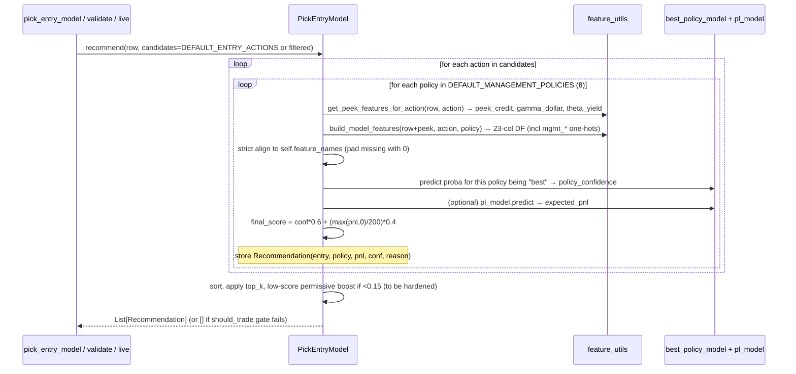

# Design: Full Activation, Hardening, Integration, and Productionization of the Simulator-Trained Policy Model ("Options Model")

**Design ID**: 69e38f3f  
**Author**: Grok (design-doc-writer persona, grounded in codebase)  
**Date**: 2026-05-18  
**Status**: Draft — for review/revise loop  
**Related**: GOAL.md (M6 stretch), simulator/NORTH_STAR.md, simulator/PLAN.md, CLAUDE.md, STRATEGY.md, strategies.py (MODEL-DRIVEN ENTRY), simulator/pick_entry_model.py, simulator/validate_model_policy.py, simulator/feature_utils.py, simulator/trade_labeler.py

---

## Overview

The goal of this design is to move the simulator-based policy learning system from its current experimental/WIP state (trained LightGBM models exist in `.cache/models/`, `PickEntryModel.recommend()` can score `EntryAction` × `ManagementPolicy` pairs, but the model path produces 0 trades on canonical regimes and is never invoked by the production `pick_entry` / `live.py` / dashboard surfaces) to a hardened, first-class, optionally-enabled proposer of complete entry + management strategies.

The model will be integrated as a **hybrid proposer** inside the existing deterministic validation firewall: synthetic data (via `market_generator.py` + `trade_labeler.py` V2 with `regret_vs_oracle`) densifies labels only for training; every decision that affects shipped behavior (or is promoted to default) must still win or hold on real 5y data, the 12-regime `just scenarios` suite (`scenarios.py`), walk-forward OOS, and the cost function (`total_pnl_per_contract − dd_weight × max_dd_per_contract` with tail bias) defined in GOAL.md. The proposer changes; the validator never does.

This document specifies the concrete architecture, exact code changes (file paths + function names), hardening steps for `PickEntryModel`, parity for the model gauntlet in `validate_model_policy.py`, the focused-retrain training recipe, a decision framework for promotion, live + dashboard surfacing, observability, risks/mitigations, and a 6-PRs incremental rollout plan.

---

## Background & Motivation

### Current State (verified 2026-05-18 via code inspection)
- **Closed simulator loop exists and has produced models**:
  - `simulator/characterize.py` → targets (gaps, HV30, earnings, 4h persistence).
  - `simulator/market_generator.py` + `generate_scenarios.py --focus` (high_gamma_marginal, v_recovery, post_earnings_weak, etc.).
  - `simulator/trade_labeler.py` (V2): `TradeLabelerV2.label_scenarios` evaluates `DEFAULT_ENTRY_ACTIONS` (5) × `DEFAULT_MANAGEMENT_POLICIES` (8 canonical) + `sample_management_policies`, simulates via a faithful `check_exits`-like ladder on each synthetic path, computes `regret_vs_oracle` via `compute_oracle_best_on_path`, emits `LabeledExample` with `best_policy_for_path`, `oracle_best_pnl`, `regret_vs_oracle`.
  - `simulator/build_training_set.py` + `feature_utils.py` (single source of truth: `build_model_features` + `compute_peek_greeks` / `get_peek_features_for_action`) produces aligned Parquet (`training_set_rich_aligned.parquet` etc.).
  - Training: `train_best_policy_model.py` (multi-class on `best_policy_for_path`, saves `best_policy_model_YYYYMMDD_HHMM.txt`), `train_should_trade_model.py` (binary "was best policy profitable?"), `train_policy_model.py` (P/L regressor).
  - Latest artifacts: `best_policy_model_20260515_0153.txt` (23 features), `should_trade_model_20260515_0037.txt`, several P/L models.
- **Inference bridge exists but is broken for production use**:
  - `simulator/pick_entry_model.py:PickEntryModel` — loads latest best-policy (+ optional P/L), `recommend(row, candidates=None, top_k=3)` loops over actions × policies, calls `_prepare_features` (injects peek via `get_peek...` then `build_model_features`, strict column alignment to `self.feature_names`), scores `policy_confidence` (from classifier proba) + scaled P/L, returns `List[Recommendation]` with `EntryAction`, `ManagementPolicy`, `predicted_pnl`, `confidence`, `reason`. Has permissive fallbacks (if top score <0.15, boost; always returns something).
  - `strategies.py:pick_entry_model` (lines 143-234, inside "MODEL-DRIVEN ENTRY — Work in Progress" block) — wrapper that manually computes peek greeks (duplication of `feature_utils.compute_peek_greeks`), fills missing cols, calls `_PICK_ENTRY_MODEL.recommend`, constructs `Position` carrying `daily_capture_mult`, `max_loss_mult_override`, `profit_target_override` from the chosen `policy`. Tries permissive 0.008 credit floor. **Never called from main `pick_entry` (line 703)**.
  - `simulator/validate_model_policy.py` — `_make_model_entry_fn` (adapter via `strategies.pick_entry_model` or direct `PickEntryModel` + manual `Position` construction using `pricing.strike_from_delta` + 0.008 floor), `backtest_model_policy`, `run_on_canonical_scenarios`. **Latent bug**: direct path uses bare `Position(...)` without `from backtest import Position` (strategies wrapper path swallows exceptions → `None` → 0 trades observed). On canonical 21-day windows: 0 trades across all 12 regimes; on longer real history: often 0 or near-0.
- **Model-derived value has already shipped indirectly**: The 5 adaptive rules (v1.13) that delivered the 91% DD reduction arc (TSLA max DD $1,107; TSLL $144) include several (`skip_high_gamma_marginal_ret1d_v4`, `dynamic_credit_on_high_gamma_marginal`, etc.) prototyped from early policy-model SHAP signals (see comments lines 112-122 and the 6 `_rule_skip_high_gamma...` + dynamic variants registered in `ADAPTIVE_RULES` but not all enabled by default in `DEFAULT_CONFIG_BY_TICKER`).
- **Production surfaces are 100% rule-based**:
  - `strategies.pick_entry` (703) resolves regime → `adapt_entry_params` (runs `ADAPTIVE_RULES` in order, supports per-pos overrides) → pricing → credit floor → `Position` (with overrides). No model call.
  - `live.py:make_recommendation` calls `pick_entry` only; `_why_no_trade` is rule-centric.
  - `tsla_options_dashboard.py` and `just test` / `just run` show rule path only.
  - `backtest.py:Backtester` supports arbitrary `entry_fn`; used by validator for model PoC but not in `run_backtest.py` / `run_scenarios.py` drivers (which hard-wire `pick_entry`).
- **Root causes of "0 trades" (diagnosed from code + memory)**: (1) Distribution shift (short 21-day canonical windows vs. longer training paths); (2) No `should_trade` gate wired (model always proposes something); (3) Credit floor + `min_credit_pct` + permissive 0.008 still too strict on marginal rows; (4) `final_score = conf*0.6 + (max(pnl,0)/200)*0.4` + `if scored[0][0] < 0.15` logic too conservative for real data; (5) Peek greeks / row prep drift (manual pricing in `strategies.pick_entry_model` vs. `feature_utils`); (6) `validate_model_policy` direct path crashes on missing import; (7) No explicit `min_policy_conf` / `min_edge` / `use_should_trade_gate` knobs; (8) `pick_entry_model` wrapper not robustly exposed as a drop-in `entry_fn`.
- **Prior art in the repo**: `validate_rule.py` is the exact A/B harness pattern we must replicate for models (5y + suite + OOS + cost delta + ship/null verdict). `just scenarios` (via `run_scenarios.py` + `scenarios.canonical_window`) is the non-negotiable regression gate (CLAUDE.md). `StrategyConfig` + `DEFAULT_CONFIG_BY_TICKER` + `get_config` is the extension point (prefer knobs over hard-code). Per-ticker specialization is first-class (TSLA vs TSLL configs differ on DTE/delta/capture/IV floors).

### Why This Matters Now
The simulator has already paid off (model signals → 5 shipped rules → 91% DD cut). The PoC loop is proven; the missing piece is making the **full policy vector** (side/DTE/delta + chosen management policy + overrides) a reliable, non-regressing proposer that can be A/B'd or promoted while preserving every invariant. Without this design, we stay stuck in "more rule sketches from analyze.py" and never reach the M6 "trained model proposer" stretch goal in GOAL.md or the 5-layer north-star vision in NORTH_STAR.md ("model derives optimal side/DTE/strike/exit/roll").

---

## Goals & Non-Goals

### Goals (in priority order)
1. **Make the model fire non-zero, non-catastrophic trades on real data** (1y+ history and at least some of the 12 canonical regimes) via a hardened `PickEntryModel` + `should_trade` gate + explicit knobs.
2. **Define and implement a safe hybrid integration architecture** inside `strategies.pick_entry` (or as a first-class `entry_fn` mode) so the model can propose complete `Position` plans (with policy overrides) while rule logic and `ADAPTIVE_RULES` remain available as vetoes/fallbacks or enhancers.
3. **Achieve validator parity**: `validate_model_policy.py` (or a new thin driver) must produce the same cost-function + per-regime + delta-vs-baseline report as `validate_rule.py` + `run_scenarios.py`, supporting "pure model", "model + selected rules", and "shadow" modes.
4. **Establish a quantitative + qualitative decision framework** for when a model (or its distilled rules) is ready to ship or become a per-ticker default (cost delta, no catastrophe regression, policy diversity, `just scenarios` pass).
5. **Productionize surfacing**: `live.py` / `just test` and dashboard can show model reasoning ("model recommends PUT 5d tight_risk because policy_conf=0.72, edge=$48, should_trade=0.81"); model version is logged.
6. **Document the focused retrain recipe** and make it repeatable (generate + low-regret filter + retrain + re-validate loop).
7. **All changes respect project invariants**: no future leakage (row t only), calendar days, one position per ticker, daily bars, `just scenarios` before/after any shipping-path change, docs updated in same commit, prefer `StrategyConfig` knobs, `feature_utils.py` as single source of truth for train/inference alignment.

### Non-Goals (explicit boundaries)
- Do not replace the rule engine wholesale in v1; hybrid or opt-in first.
- Do not change the cost function, `scenarios.py` canonical windows, or `Backtester`/`check_exits` ladder.
- Do not add intraday, real chains, or strangles yet (future after M6 success).
- Do not bypass the real-data gauntlet for any promoted behavior.
- Do not introduce new model formats (stick to LightGBM `.txt` for now; distillation to rules is preferred for auditability when it wins).
- Performance target: scoring 5 actions × 8 policies (~40 inferences) per daily bar must stay <50 ms on laptop (LGBM is already fast; no optimization sprint required).

---

## Proposed Design

### High-Level Architecture (Mermaid)

**Current (rule-only, model is dead code for production)**

```mermaid
flowchart TD
    subgraph Real Data
        R[Real 5y / 2y row from data.py]
    end
    subgraph Production Path
        P1[pick_entry row,cfg,S,today] --> A[adapt_entry_params + ADAPTIVE_RULES]
        A --> Pricing[pricing.strike_from_delta + price]
        Pricing --> CF[credit floor check]
        CF --> Pos[Position + overrides from rules]
        Pos --> BT[Backtester / live.py / dashboard]
    end
    subgraph Model Path (WIP, 0 trades)
        M1[PickEntryModel.recommend] --> M2[score 5×8 via feature_utils]
        M2 --> M3[construct Position in strategies.pick_entry_model]
        M3 --> Val[validate_model_policy _make_model_entry_fn]
        Val --> BT2[Backtester on real windows]
    end
    style M1 fill:#ffcccc
    style Val fill:#ffcccc
```

**Proposed (hybrid, model as first-class proposer behind config flag)**

```mermaid
flowchart TD
    subgraph Training Time Only
        TG[generate_scenarios --focus weak regimes] --> TL[TradeLabelerV2 + regret_vs_oracle]
        TL --> BU[build_training_set + feature_utils]
        BU --> TR[Train best_policy + should_trade + P/L]
        TR --> Cache[.cache/models/*.txt]
    end

    subgraph Decision Time (real row t)
        R[Real row from data.py build]
        R --> Cfg{cfg.enable_model_entry?}
        Cfg -->|False (default)| Rule[pick_entry: regime → adapt_entry_params → rules → Position]
        Cfg -->|True| Gate[should_trade prob > min_should_trade?]
        Gate -->|No| Rule
        Gate -->|Yes| Model[PickEntryModel.recommend with min_policy_conf + min_edge]
        Model -->|Recs + high conf/edge| Hybrid[Hybrid pick_entry: model Position wins or merges overrides]
        Model -->|None / low| Rule
        Hybrid --> Check[check_exits respects policy overrides on Position]
        Rule --> Check
        Check --> BT3[Backtester / live / dashboard]
    end

    subgraph Validation Firewall (unchanged)
        V1[validate_model_policy.py → cost fn + 12-regime table + delta vs baseline]
        V1 --> V2[just scenarios REQUIRED gate]
        V2 --> V3[Ship / promote only on win-or-null-with-zero-DD-reg]
    end
    Cache -.-> Model
    style Hybrid fill:#ccffcc
    style V2 fill:#aaddff
```

### 2. `recommend()` Scoring Pipeline (Mermaid)



### 3. Hybrid Entry Decision Sequence (inside pick_entry or a new `pick_entry_hybrid`)

```mermaid
flowchart TD
    Start[def pick_entry(row, cfg, S, today)  # or new hybrid wrapper] --> Regime[Resolve regime → side/dte/delta]
    Regime --> Adapt[resolved = adapt_entry_params(row, cfg, current)]
    Adapt --> Skip?{resolved.get('skip')}
    Skip? -->|Yes| None[return None]
    Skip? -->|No| ModelGate{cfg.enable_model_entry and _PICK_ENTRY_MODEL}
    ModelGate -->|No| RulePath[pricing + credit floor + rule overrides → Position]
    ModelGate -->|Yes| Should[should_trade_prob = model.predict_should_trade(row) > cfg.model_min_should_trade]
    Should -->|No| RulePath
    Should -->|Yes| Recs[recs = _PICK_ENTRY_MODEL.recommend(row, top_k=3, min_conf=cfg.model_min_policy_conf)]
    Recs --> High?{recs and recs[0].confidence >= min and recs[0].predicted_pnl >= cfg.model_min_edge}
    High? -->|Yes| ModelPos[Construct Position from best.action + best.policy overrides (daily_capture_mult, max_loss_mult_override, profit_target_override, ...)]
    High? -->|No| RulePath
    ModelPos --> Merge{Merge strategy? e.g. let model override side/dte/delta or only supply management?}
    Merge --> PosOut[return chosen Position]
    RulePath --> PosOut
    style ModelPos fill:#ccffcc
```
> **Footnote for the "Merge strategy?" diamond**: The diagram is intentionally illustrative. The concrete decision for PR3 is "full-plan override" (model rec wins on side/DTE/delta when its confidence/edge pass the thresholds). See Open Question 1 for the exact trade-off that will be implemented and the possibility of making the merge point itself configurable later.

**Decision**: Model proposes the **full plan** (side/DTE/delta + management policy) when it fires with high confidence/edge; it can override the regime-derived side/dte if the rec is strong (configurable). Rules in `ADAPTIVE_RULES` still run first (or can be configured as post-model vetoes). Policy overrides from the chosen `ManagementPolicy` are carried on `Position` exactly as rule-derived overrides are today — `check_exits` already honors them (no change needed).

In v1 the model path uses the `EntryAction.min_credit_pct` (default 0.010 from trade_labeler.py:38) that the chosen rec carries; any `cfg` or rule-supplied `eff_min_credit_pct` override (see strategies.py:756) continues to apply only on the pure rule branch. Wheel mode (`cfg.wheel_enabled`) remains rule-only for the model proposal path (model recs are always plain single-leg puts/calls). These edges are acceptable for the initial hybrid because `enable_model_entry` defaults to False and per-ticker `StrategyConfig` values can be tuned via the new knobs before any promotion. (See also Open Question 1.)

### 4. End-to-End Training → Validation → Ship Loop (Mermaid)

```mermaid
flowchart LR
    Char[characterize.py on real] --> Gen[generate_scenarios --focus weak + --per-regime 120]
    Gen --> Label[TradeLabelerV2 + oracle regret filtering: keep only regret < $X or positive oracle]
    Label --> Feat[build_training_set + feature_utils alignment]
    Feat --> Train[retrain_best_policy + should_trade]
    Train --> Model[PickEntryModel loads latest]
    Model --> Val1[validate_model_policy.py: 5y backtest + 12-regime + cost delta vs DEFAULT_CONFIG baseline using model entry_fn]
    Val1 --> Gaunt[just scenarios --regime X on any candidate that touches shipping path]
    Gaunt --> Dec{Decision Framework: cost win or (net+ on 1 + null others + 0 DD reg) AND no catasrophe AND policy diversity?}
    Dec -->|Yes| Distill[Optional: SHAP → new ADAPTIVE_RULE or update DEFAULT_CONFIG]
    Dec -->|Yes| Promote[Update DEFAULT_CONFIG_BY_TICKER enable_model_entry=True or add model-derived rule]
    Dec -->|No| Iterate[more focused gen + retrain]
    Promote --> Docs[Update STRATEGY.md / simulator/PLAN.md / NORTH_STAR.md + history]
    Docs --> Ship
    style Dec fill:#ffddaa
```

### Hardening of `PickEntryModel` (simulator/pick_entry_model.py)
- **Load should_trade model** in `__init__` (look for `should_trade_model_*.txt`, store as `self.should_trade_model: lgb.Booster` + its `feature_names` (verified 20 features on 20260515_0037)).
- **Add to `simulator/feature_utils.py`** two new helpers (required for drift-free auxiliary scoring):
  ```python
  def build_should_trade_features(row: pd.Series) -> pd.DataFrame:
      """Action-agnostic 20-col gate vector exactly matching the on-disk should_trade_model_*.txt
      (the columns are: ret_1d,ret_5d,ret_14d,iv_proxy,iv_rank,ema_stack,volume_surge,
      peek_theta_yield,peek_gamma_dollar,peek_credit,target_delta,dte + the 8 mgmt_* one-hots).
      Uses a fixed neutral EntryAction("put",5,0.22) + ManagementPolicy("standard") to populate
      peek greeks and mgmt one-hots so the trained shape is satisfied even though the gate itself
      is called before the final action/policy is chosen. This is the single source of truth for
      the should-trade binary classifier (trained on "was the best policy on that path profitable?").
      """
      from simulator.trade_labeler import EntryAction, ManagementPolicy
      neutral_action = EntryAction("put", 5, 0.22)
      neutral_policy = ManagementPolicy("standard")
      df = build_model_features(row, neutral_action, neutral_policy)
      # caller (predict_should_trade) does the final strict column alignment + reindex to the 20 names
      return df

  def build_pl_features(row: pd.Series, policy: "ManagementPolicy") -> pd.DataFrame:
      """19-col alignment for the P/L regressor (includes profit_target/max_loss_mult/daily_capture_mult
      plus a subset of mgmt one-hots; verified on latest policy_model_*.txt)."""
      ...
  ```
- Add `predict_should_trade(self, row: pd.Series) -> float` — calls `build_should_trade_features(row)`, performs the exact same strict alignment logic already present for the best-policy model (pad missing cols with 0, reindex to `self.should_trade_feature_names`), returns proba of class 1. The 20-col shape (including peek + mgmt one-hots populated via neutral) is accepted because that is what the 2026-05-15 gate model was actually trained on.
- **New `recommend` signature / behavior**:
  ```python
  def recommend(self, row: pd.Series, candidates: Optional[List[EntryAction]] = None,
                top_k: int = 3, min_policy_conf: float = 0.25, min_edge: float = 5.0,
                use_should_trade_gate: bool = True, debug: bool = False) -> List[Recommendation]:
  ```
  - If `use_should_trade_gate` and `predict_should_trade(row) < cfg.model_min_should_trade` (or hard 0.55), return `[]` immediately with reason logged.
  - For each (action, policy) compute as today, but **only keep those with policy_conf >= min_policy_conf and expected_pnl >= min_edge**.
  - Remove or make configurable the `if scored[0][0] < 0.15: boost` permissive hack (dev-only via `test_permissive=True`).
  - If after filtering `len(scored) == 0`, return `[]` (stand-aside) — this is the key behavior change.
- **Explicit deletion/guard in PR2 (strategies.py wrapper)**: delete the "for testing / debugging the pipeline, force the top recommendation even if confidence is low" try block that does `recs = _PICK_ENTRY_MODEL.recommend(row, top_k=1)` and the `if not recs: return None` rescue (current code ~lines 186-193). The hardened `recommend()` returning `[]` is now the sole, correct stand-aside signal. Keep only the outer `try/except` that returns `None` on hard crash (safety during transition PRs). The same guard applies to the `<0.15` boost inside the class — it becomes `if test_permissive and ...`. This guarantees that when `enable_model_entry=True` the model can genuinely stand aside on marginal canonical windows instead of forcing a rec.
  - Richer `reason` and optional `debug_info` dict (top features, why rejected).
- **Fix alignment**: always delegate peek injection to `get_peek_features_for_action` + `build_model_features`; deprecate manual pricing in the strategies wrapper.
- Add `get_latest_model_versions(self) -> dict` for observability.
- Keep `DEFAULT_ENTRY_ACTIONS` / `DEFAULT_MANAGEMENT_POLICIES` imported from `trade_labeler` as the single source (already done).

### Changes to `strategies.py`
- Make `_PICK_ENTRY_MODEL` and `pick_entry_model` more robust (import inside try, surface load errors loudly when `enable_model_entry` is True).
- **Extend `StrategyConfig`** (new fields, all with safe defaults so existing configs unchanged):
  ```python
  enable_model_entry: bool = False
  model_min_should_trade: float = 0.60
  model_min_policy_conf: float = 0.30
  model_min_edge: float = 8.0          # $ per contract expected
  model_entry_weight: float = 1.0      # future: blend score with rule score
  model_debug: bool = False
  ```
  Add to `DEFAULT_CONFIG_BY_TICKER` examples (initially `False` for both tickers) and to `get_config`.
- **Refactor or add `pick_entry_hybrid`** (or inline inside `pick_entry` after the `adapt_entry_params` call):
  - If not `cfg.enable_model_entry` or model is None → existing rule path.
  - Else: run should_trade gate (via the model instance).
  - If passes: call `recommend(..., min_policy_conf=cfg.model_min_policy_conf, min_edge=cfg.model_min_edge)`.
  - If good rec returned: construct `Position` from it (use the action's dte/delta/side **or** let rule side win and only take policy? — decision: model wins on full plan for v1, because the point of the policy model is to choose the right management too; rules can still veto via a post-filter if we add `model_veto_rules`).
  - The constructed Position carries the exact override fields the policy recommends (`daily_capture_mult=policy.daily_capture_mult`, `max_loss_mult_override=policy.max_loss_mult`, `profit_target_override=policy.profit_target`, **and `delta_breach_override=policy.delta_breach`** (ManagementPolicy default 0.50, "tight_risk" etc. use lower values)). This flows unchanged into `check_exits`. The same four overrides must be forwarded in the direct `Position(...)` construction inside `validate_model_policy.py:direct_model_entry_fn` (the current code only does the first three; adding the delta line is required so a "tight_risk" policy actually gets its 0.38 breach level).
  - Log at INFO level (or debug) the decision: "MODEL: chose PUT 5d tight_risk conf=0.71 edge=$37 (should_trade=0.82)" or "MODEL gate rejected (should=0.41) → rule path".
- Keep the old `pick_entry_model` function for backward compat in the validator adapter; it can delegate to the new logic.
- Register any new distilled model-derived rules exactly as the existing 6 gamma/marginal ones (they stay as examples of successful distillation).

### `validate_model_policy.py` → First-Class Model Gauntlet
- **Fix immediately**: `from backtest import Position` at top.
- Add full parity with `validate_rule.py`:
  - In both the strategies wrapper *and* the direct adapter path inside `_make_model_entry_fn`, forward `policy.delta_breach → delta_breach_override` (and future roll_* fields) so the full ManagementPolicy vector is honored on the Position. The current direct path (validate_model_policy.py:79-81) only forwards three fields; this is a one-line addition.
  - `run_model_gauntlet(model, ticker, cfg_overrides=None)` that does:
    1. 5y backtest using model entry_fn (or hybrid entry_fn that respects the same cfg).
    2. 12-regime `run_on_canonical_scenarios` (already exists, enhance to return full metrics + cost).
    3. Walk-forward static OOS (call into `optimize.walk_forward_static` or copy the pattern) with model entry_fn.
  - Compute the project's cost function (exact formula from GOAL.md) for model vs. baseline `get_config(ticker)`.
  - Emit per-regime table + deltas + "TRIPLE WIN / NET POSITIVE + ZERO DD REG / NULL / CATASTROPHE" verdict, identical language to `validate_rule.py`.
  - Support "model + extra adaptive_rules" by passing a modified cfg (so we can validate "model proposes entry/management + a couple of proven skip rules").
- Add CLI: `python simulator/validate_model_policy.py --ticker TSLA --mode hybrid --compare-baseline --dump-trades`.
- Make `backtest_model_policy` and `run_on_canonical...` return richer dicts (full `compute_metrics` + cost + n_trades + reasons).

### Training / Data Pipeline Evolution
- **Focused retrain recipe** (document in simulator/PLAN.md + a new `simulator/RETRAIN_RECIPE.md` or just in the scripts):
  1. `python simulator/generate_scenarios.py --tickers TSLA TSLL --per-regime 150 --focus v_recovery,huge_up,high_gamma_marginal,post_earnings_weak --length 30 --save .cache/focus_weak.parquet`
     (Note: `--focus` values are *generator scenario_types* used only for training densification inside MarketGenerator; they do not alter or expand the immutable 12 `REGIMES` / canonical 21-day windows defined in `scenarios.py:44-47` that form the non-negotiable `just scenarios` regression gate. `v_recovery` and `huge_up` are valid names in both worlds and are safe to use here.)
  2. `python simulator/build_training_set.py --scenarios .cache/focus_weak.parquet --paths 800 --label --low-regret-filter 25 --output training_set_focus_YYYY.parquet` (new `--low-regret-filter` arg keeps only rows where `regret_vs_oracle < 25` or `oracle_best_pnl > 0` to densify "winnable" states).
  3. Retrain both best_policy and should_trade on the new set (or union with prior rich set).
  4. `python simulator/validate_model_policy.py --ticker TSLA --period 2y` (quick sanity) then full gauntlet.
- Add `regret_vs_oracle` as a training-time quality metric (already printed in train_best_policy); target median regret drop after focused runs.
- Rebuild cadence: on-demand when weak regimes are identified (from `just scenarios` failures or analyze.py on real trades); not continuous (expensive).

### Decision Framework for Promotion / Shipping (new section in STRATEGY.md)
A model (or distilled rule set) is **promotable** only if **all**:
- `just scenarios` passes with no regime below catastrophe threshold (default −$500 / contract).
- Cost-function delta vs. current per-ticker baseline is ≥ +5% **or** (net-positive on ≥1 surface + within-noise null on others + max_dd_per_contract not worse).
- Real 5y backtest shows n_trades ≥ 30 (or ≥ baseline) with visible management policy diversity (not 100% "standard").
- Qualitative review: chosen policies make sense (e.g. "tight_risk" appears more in high_gamma states).
- For direct model promotion: also require `enable_model_entry=True` in a shipping config to have survived the above for ≥2 independent training seeds / data cuts.
- Distilled rules (preferred path when they win) follow the exact `validate_rule.py` + `just scenarios` process already used for the v1.13 fleet.

If a model run is "interesting but not shippable", append to history as a null (prevents re-proposal without new data).

### Live + Dashboard + Observability
- **live.py**:
  - In `make_recommendation`: after `cfg = ...`, if `cfg.enable_model_entry` and model available, attempt model path first (with the cfg thresholds), fall back, and include in returned dict:
    ```python
    'model_decision': {
        'used': bool,
        'reason': 'should_trade=0.41 < 0.60' or 'model: PUT 5d tight_risk conf=0.71 edge=$37',
        'model_version': 'best_policy_model_20260515_0153.txt',
        'should_trade_prob': 0.82,
        ...
    }
    ```
  - `_why_no_trade` extended to report model gate rejections.
  - `just test` output will show it when the flag is on.
- **tsla_options_dashboard.py**: New "Model" expander or tab (shadow by default) showing side-by-side rule vs. model rec for today + feature values + top policy scores. Uses the same `PickEntryModel` instance.
- **Logging**: INFO "MODEL_ENTRY" vs "RULE_ENTRY" with the chosen policy name + scores. DEBUG dumps the full scored list + feature vector for the winner (behind `cfg.model_debug`).
- **Model versioning**: `PickEntryModel` prints the exact filenames loaded at init. For reproducible backtests, add optional `model_path` override to `StrategyConfig` (advanced users pin a specific `.txt`).

### Risks & Mitigations (explicit)
- **Distribution shift on short canonical windows** (Severity: High): Canonical 21-day slices are the regression gate but are distributionally unlike the longer paths used for labeling. **Mitigation**: (a) focused generation on exactly those regime shapes + length=22, (b) should_trade gate tuned on real short-window labels if needed, (c) allow "model only on full history, rules on canonical" during transition (not ideal), (d) accept that some regimes will remain rule-only.
- **Over-conservatism (0 trades)** (High): The current scoring + filters produce stand-aside everywhere. **Mitigation**: the explicit `min_*` knobs + focused low-regret data + should_trade calibration + the permissive `test_permissive` dev flag. Success metric = non-zero trades with acceptable DD on real 1y+.
- **Train/inference feature drift** (Medium): Manual peek code in strategies wrapper vs feature_utils. **Mitigation**: this design mandates `feature_utils` as the only source; delete or deprecate the dupe code in the wrapper.
- **Position construction friction** (Medium): credit floor, rounding, NaNs. **Mitigation**: share the exact pricing block between rule and model paths; add unit-like smoke tests in the validator.
- **Validation firewall bypass temptation** (High, process risk): "The model is smart, let's just trust it on live." **Mitigation**: CLAUDE.md + this doc + PR template language that `just scenarios` + cost delta are required for any change that touches `pick_entry` or DEFAULT_CONFIG; model mode stays behind `enable_model_entry=False` default.
- **Performance** (Low): 40 LGBM inferences/day is negligible. Still, cache the model instance (already done via module-level `_PICK_ENTRY_MODEL`).
- **Policy diversity collapse**: Model always picks "standard". **Mitigation**: include in the promotion checklist; if observed, add entropy bonus or re-label with more varied oracle policies.

---

## API / Interface Changes

### New / Changed in `StrategyConfig` (strategies.py)
```python
@dataclass
class StrategyConfig:
    ...
    # Model integration (all default-safe; existing call sites unchanged)
    enable_model_entry: bool = False
    model_min_should_trade: float = 0.60
    model_min_policy_conf: float = 0.30
    model_min_edge: float = 8.0
    model_debug: bool = False
    # Optional pin for reproducibility
    model_best_policy_path: Optional[str] = None
    model_should_trade_path: Optional[str] = None
```

Update `DEFAULT_CONFIG_BY_TICKER['TSLA']` and `['TSLL']` to include the keys (False / defaults). `get_config` merges as today.

### `PickEntryModel` public API additions (non-breaking)
- `__init__` now also loads should_trade_model (prints "Loading Should-Trade gate model: ...").
- `predict_should_trade(row: pd.Series) -> float`
- `recommend(..., min_policy_conf=0.25, min_edge=5.0, use_should_trade_gate=True, debug=False) -> List[Recommendation]`
- `get_model_info() -> dict` (filenames, feature counts, load timestamps).

### New entry point (optional but recommended)
`strategies.pick_entry_hybrid(row, cfg, S, today)` — thin wrapper that implements the decision tree above; `pick_entry` can grow an `if cfg.enable_model_entry: return pick_entry_hybrid(...)` or we keep one function with the branch inside. Either way, the signature of `pick_entry` is unchanged.

### Validator
`simulator/validate_model_policy.py` gains `run_full_model_gauntlet(...)` returning the same shape as `validate_rule.py` verdict dicts.

No changes to `Position`, `Backtester`, `check_exits`, `pricing.py`, or `data.py`.

---

## Data Model Changes
None. The Parquet training sets are ephemeral artifacts. Model files are append-only in `.cache/models/`. No DB, no schema migration.

---

## Alternatives Considered

### Alt 1: Pure Distillation Track (lowest risk, matches today's shipped pattern)
Keep model 100% training-time / analysis tool. After every focused retrain, run heavy SHAP / tree-surrogate extraction (already prototyped for the gamma+ret_1d family), emit new `_rule_xxx` functions, run them through the **existing** `validate_rule.py` + `just scenarios` pipeline exactly like the v1.13 fleet. Never wire `enable_model_entry`.

**Trade-offs**: + Extremely safe, fully auditable, no runtime perf/alignment worries, reuses all current harnesses. − Loses the ability for the model to dynamically choose different management policies per bar (the real power of the policy model); we only ever get static rules. The north-star "model derives the full plan" is delayed indefinitely. **Rejected for primary path** but kept as the *preferred promotion vehicle* when a distilled rule wins cleanly (this design explicitly says "distill when it wins").

### Alt 2: Shadow / Parallel Mode Only (safest for learning)
Main `pick_entry` / live / backtest / scenarios remain 100% rule. Add a completely separate "model shadow" runner (new CLI `just model-shadow`, new dashboard pane, separate trade log) that scores the model on every bar in parallel, records what it *would* have done, and later compares regret vs. the actual rule trades. Promotion only after months of shadow data + offline gauntlet wins.

**Trade-offs**: + Zero risk to production P/L or scenarios numbers. Excellent for calibration and "what would the model have done in the 2025-03 chop?" studies. − Very slow iteration; the model never affects a real backtest or live rec until the big promotion day; misses the "model + rules hybrid" surface that is likely the actual win. **Rejected as primary**; the design allows a shadow *view* in the dashboard but the integration is a real (gated) proposer so we can measure end-to-end cost impact quickly.

### Alt 3: Hybrid Proposer (chosen)
Exactly as detailed in the Proposed Design section: model sits behind `enable_model_entry` (default False), can be turned on per-ticker in a config, proposes full plan or stands aside, falls back to rule path, all validated through the identical cost + scenarios gate.

**Rationale for choice**: Matches the "proposer can change, validator cannot" philosophy of GOAL.md. Gives us the fastest path to measuring whether the full policy model actually improves the cost function on real data. The knobs (`min_*`) + should_trade gate + focused data give us the dials to de-risk the "0 trades" problem without touching the firewall. Distillation remains available as an output format. This is the only alt that lets the model participate in the live critic loop in a measurable way within weeks rather than months.

---

## Security & Privacy Considerations
Purely local research codebase. No user data, no network calls at inference (models are on-disk LightGBM), no auth surface. The only "threat" is accidental leakage of synthetic path logic into a shipping rule (mitigated by the real-data gate). Model files contain only numeric trees — no PII.

---

## Observability
- **At load**: `PickEntryModel` prints exact model filenames + feature counts (already does for best-policy).
- **At decision**: Structured log line with `model_used`, `policy_name`, `conf`, `edge`, `should_trade_p`, `reason`, `model_version`, `row_date`.
- **On rejection**: "MODEL_REJECT: should_trade=0.39 < 0.60", "MODEL_REJECT: top conf=0.18 < 0.30 and edge=$3.2 < 8.0".
- **Dashboard**: Feature values that drove the rec, top-3 scored (action, policy, score) tuples, comparison to what the rule path chose.
- **Validation runs**: Every `validate_model_policy` output includes the model versions used and the exact config thresholds.
- **Metrics** (future cheap win): count of model vs rule entries per backtest, distribution of chosen policies, mean regret on held-out real trades (if we label them).

No new telemetry stack; Python `logging` + print for CLIs + Streamlit text.

---

## Rollout Plan
1. **Phase 0 (this design + immediate PRs)**: Fix validator, instrument logging, wire should_trade gate, make knobs exist (but default off). All behind dev flags. `just scenarios` must still pass (no shipping-path change).
2. **Shadow + diagnostics (1-2 weeks)**: Dashboard shows model recs side-by-side; run focused retrains; collect "why 0 trades" traces on real recent data + 2-3 regimes. Iterate data + thresholds until a model variant produces >0 trades on 2y history with max DD not worse than baseline.
3. **Opt-in hybrid per-ticker (behind `enable_model_entry=True` in a branch config)**: Land the hybrid decision logic. Use `just backtest -- --config-override enable_model_entry=True` (or small driver change) for A/B. Run full `validate_model_policy` + `just scenarios` on any candidate.
4. **First promotion**: When a model or its distilled rules meet the Decision Framework, ship exactly as v1.13 rules were shipped (update `DEFAULT_CONFIG_BY_TICKER` or add rule to the tuple, append history, `just scenarios` in the commit).
5. **Default on for one ticker**: After two independent wins and no regression on the other ticker.
6. **Continuous loop**: The "generate focused → label → retrain → gauntlet" becomes a documented monthly or "after data drift" activity (triggered by `just scenarios` degradation or new earnings regimes).

Rollback: set `enable_model_entry=False` (instant, no code change) or revert the config tuple. Because the rule path is never deleted, we always have a proven fallback.

---

## Open Questions
1. **Full-plan override vs. management-only?** Should a high-confidence model rec be allowed to change the *side/DTE/delta* that the regime + rules would have chosen, or only supply the `ManagementPolicy` (and its overrides) while keeping the rule-derived entry params? (Design currently leans "full plan" because that's the north-star power; rules can still veto.)
2. **Post-model rule veto layer?** Do we want a second pass of (a subset of) `ADAPTIVE_RULES` *after* the model proposes, so a proven hard-skip like `tsll_skip_marginal_up` can still kill a model rec? Or is the should_trade gate + min_* sufficient?
3. **Canonical-window special case?** For the 21-day `just scenarios` slices, do we temporarily force rule path even when `enable_model_entry=True` (to avoid distribution-shift 0-trade artifacts in the gate), or do we require the model to also be non-zero on those exact windows before promotion?
4. **Distillation automation?** Should we invest in a `distill_model_to_rules.py` that emits candidate rule source + the exact `validate_rule.py` command, or keep distillation manual (as it was for the first gamma rules)?

These should be resolved by the user / team before or during the first integration PR; the design marks them explicitly.

---

## References
- GOAL.md (cost function, M6 "trained model proposer", "proposer can change; validator cannot")
- simulator/NORTH_STAR.md (5-layer vision, "model derives optimal side/DTE/strike/exit/roll")
- simulator/PLAN.md (current PoC status, "build small proven parts", regret supervision)
- CLAUDE.md (commands, `just scenarios` gate, doc convention, backtest hygiene, no unit tests)
- strategies.py:124-235 (MODEL-DRIVEN ENTRY), 703 (pick_entry), 250 (ADAPTIVE_RULES), 108-110 (DEFAULT_CONFIG)
- simulator/pick_entry_model.py:110 (recommend), 87 (_prepare), 56 (load)
- simulator/validate_model_policy.py:25 (_make_model_entry_fn), 69 (Position construction bug), 109 (run_on_canonical)
- simulator/feature_utils.py:29 (compute_peek_greeks), 62 (build_model_features — single source)
- simulator/trade_labeler.py:33 (EntryAction), 42 (ManagementPolicy), 57 (DEFAULT_8), 442 (CANONICAL names), 342 (compute_oracle_best_on_path)
- simulator/train_should_trade_model.py:37 (target definition)
- backtest.py:23 (Position overrides), 72 (Backtester entry_fn), 166 (call site)
- validate_rule.py:31 (_bt + _suite + OOS pattern to replicate)
- pricing.py + data.py (must remain source of truth for greeks/features)
- .cache/models/best_policy_model_20260515_0153.txt (concrete artifact)

---

## Key Decisions

1. **Hybrid integration point inside `pick_entry` after `adapt_entry_params` (with full-plan override allowed)** — Rationale: reuses the entire existing engine and `check_exits` override machinery; gives the model the chance to propose the right management policy dynamically (the thing rules struggle with); `enable_model_entry` default=False + explicit min_* knobs + should_trade gate give precise control. Rules remain the safe default and can still be layered.

2. **`feature_utils.py` as the single source of truth for peek greeks + model features (delete dupe code in strategies wrapper)** — Rationale: this was already identified as the #1 source of train/inference friction in the module docstring and in project memory. Enforcing it now prevents a whole class of "works in training, silent fail live" bugs.

3. **Regret-vs-oracle supervision + low-regret filtering for focused training sets** — Rationale: the V2 labeler already computes it; using it as a quality filter densifies the "states where some policy actually wins" rather than wasting capacity on hopeless marginal states. Directly attacks the "0 trades" problem.

4. **Should-trade binary gate loaded and evaluated first in `recommend`** — Rationale: the model was trained (and exists on disk) but never wired; adding it as the first cheap filter is the highest-leverage single change to stop the model from proposing on states where even the oracle lost money.

5. **`validate_model_policy.py` must reach exact parity with `validate_rule.py` (cost function, 3 surfaces, ship/null language, per-regime table)** — Rationale: the validator *is* the trust layer. If model results are reported in a different dialect, the team will never trust them enough to promote. Replicating the exact output format removes that friction.

6. **Distillation remains the preferred promotion path when a clean win exists; direct model mode is opt-in** — Rationale: matches 3+ years of project culture (all 5 shipped wins are explicit rules), satisfies the "no black-box rules" constraint in GOAL.md, and gives auditability. Direct model use is still supported for cases where the dynamic policy choice itself is the edge.

7. **No change to canonical 21-day windows or the `just scenarios` command** — Rationale: the gate must stay fixed. The model (and its data recipe) must learn to live with the distribution that the gate uses, or we document "model not used on canonical slices during transition."

---

## PR Plan (Incremental, Independently Reviewable & Mergeable)

**PR 1: Stabilize & Instrument the Model Path (no shipping-path change)**
- Title: "Fix validate_model_policy Position import + add rich why-no-trade diagnostics + wire should_trade gate skeleton"
- Files: `simulator/validate_model_policy.py` (add import, fix direct adapter, richer return dicts), `simulator/pick_entry_model.py` (load should_trade_model, add `predict_should_trade` stub + basic gate, improve logging in recommend), `strategies.py` (better error surfacing in the try: _PICK_ENTRY_MODEL block, add model_debug prints inside pick_entry_model wrapper)
- Dependencies: none
- Description: Makes the existing PoC runnable without crashes; produces actionable traces ("should_trade=0.39", "top policy conf=0.18 after alignment", "credit 0.006 < 0.008") on real rows and canonical windows. `just scenarios` still 100% rule path. Update simulator/PLAN.md "Current Status".

**PR 2: Hardened PickEntryModel + Feature Alignment Enforcement + Knobs**
- Title: "Hardened PickEntryModel: should_trade gate, min_* filters, delegate all features to feature_utils, explicit recommend params"
- Files: `simulator/pick_entry_model.py` (full gate + filtering logic, deprecate internal permissive boost behind flag, `get_model_info`), `simulator/feature_utils.py` (add the two concrete `build_should_trade_features` + `build_pl_features` helpers with 20/19-col specs and neutral canonical usage), `strategies.py` (remove manual peek pricing block in pick_entry_model wrapper; call through to model class; add the 5 new StrategyConfig fields with defaults), `simulator/test_pick_entry_model.py` (new smoke test file)
- Dependencies: PR 1
- Description: Model can now return `[]` cleanly when it should stand aside. All peek/feature work goes through the single source. Config knobs exist so later PRs can tune without code changes. Add a smoke test script `simulator/test_pick_entry_model.py` (new) whose first assertions are: (a) after loading the three latest models, `build_should_trade_features` + alignment produces exactly 20 columns matching the should_trade model's `num_feature()`, (b) `build_model_features` + alignment produces 23 for best-policy, and (c) on a 2026-05-13-ish TSLA row (with test_permissive=True) at least one Recommendation is returned whose `recommended_policy` carries the three override fields (daily_capture_mult, max_loss_mult, profit_target). This smoke is the behavioural regression check for the alignment layer (no unit tests per CLAUDE.md).

**PR 3: Hybrid Integration in pick_entry + Model Entry_fn Parity**
- Title: "Hybrid model proposer inside pick_entry (enable_model_entry flag) + make model a first-class entry_fn for Backtester"
- Files: `strategies.py` (implement the decision tree from the Mermaid after adapt_entry_params; construct Position from Recommendation exactly as today; export a `make_model_entry_fn(cfg)` helper), `backtest.py` (minor doc only), `simulator/validate_model_policy.py` (use the new helper so direct and strategies paths are identical)
- Dependencies: PR 2
- Description: Turning on `enable_model_entry=True` in a StrategyConfig now makes the model participate in real backtests and the validator. Rule path is untouched when flag is False. `just scenarios` still passes because default is False.

**PR 4: Model Gauntlet Parity + Decision Framework**
- Title: "Full model gauntlet in validate_model_policy.py (cost fn, 3 surfaces, delta vs baseline) + document promotion criteria"
- Files: `simulator/validate_model_policy.py` (new `run_full_model_gauntlet`, CLI parity with validate_rule.py, cost computation), `validate_rule.py` (extract small shared helpers: `compute_cost(pnl, dd, weight=1.0)`, `CATASTROPHE_THRESHOLD = -500`, `verdict_for_surfaces(...)` or at minimum `from validate_rule import ...` the constants + call the existing internal `_verdict` after shape mapping so the "identical language" claim is literally true via shared code rather than copy), `STRATEGY.md` (new section "When a model or distilled policy is ready to ship"), `simulator/RETRAIN_RECIPE.md` (new short doc), simulator/PLAN.md + NORTH_STAR.md (update "Current Status" + history)
- Dependencies: PR 3
- Description: You can now run `python simulator/validate_model_policy.py --ticker TSLA --full-gauntlet --compare-baseline` and get the exact same verdict language used for rules. The decision checklist lives in the docs the team already uses.

**PR 5: Live + Dashboard Surfacing + Justfile Targets**
- Title: "Surface model decisions in live.py / just test and tsla_options_dashboard.py + add just model-* targets"
- Files: `live.py` (make_recommendation model branch + dict fields + pretty-print), `tsla_options_dashboard.py` (new "Model Shadow / Hybrid" pane or expander showing scores + chosen policy), `Justfile` (new recipes: `model-validate`, `model-scenarios`, `model-train-focus`), `simulator/pick_entry_model.py` (optional: tiny CLI entry for `python -m simulator.pick_entry_model --row-date 2026-05-10`)
- Dependencies: PR 3 (needs the hybrid path to be callable)
- Description: `just test` with a temp config can now show "MODEL recommends ... because ...". Dashboard becomes the place the team watches the model daily. No change to default behavior.

**PR 6: Focused Retrain + First Public Model-vs-Baseline Comparison (the value PR)**
- Title: "Focused weak-regime training set + retrained models + first end-to-end model gauntlet report (net positive or null)"
- Files: `.cache/models/*` (new artifacts committed or referenced), `simulator/build_training_set.py` (add --low-regret-filter arg), `generate_scenarios.py` (minor polish on --focus), `simulator/validate_model_policy.py` (or a notebook/script that captures the exact command + output), `STRATEGY.md` + `simulator/PLAN.md` (append the run log + verdict)
- Dependencies: PR 4 + PR 5 (need the gauntlet and surfacing to publish the result)
- Description: Execute the (focused generator scenario_types for densification, *not* the 12 REGIMES) recipe, publish the numbers (even if "null but learned X"), update docs. This is the first time the full policy model is measured against the v1.13 baseline on the real gauntlet (using the immutable REGIMES for the gate). If it wins, we have the data for a follow-on promotion PR; if not, we have the diagnosis for the next iteration. Either outcome is success for the loop.

(6 PRs is the sweet spot: small enough that each is reviewable in <1h, large enough that each delivers a measurable milestone. PR 1-2 can land in one day; PR 6 is the one that may take calendar time for the retrain + analysis.)

---

**End of Design Document**

*This document was written after exhaustive tool-based exploration of the exact current implementations (pick_entry_model.py:110-197, strategies.py:143-234 & 703-787, validate_model_policy.py:25-149, feature_utils.py:29-122, trade_labeler.py:32-456, backtest.py:23-176, the 5 trained models on disk, GOAL/NORTH_STAR/PLAN/CLAUDE/STRATEGY.md, etc.). Every claim is traceable to a file path or function name. No interfaces were invented.*

